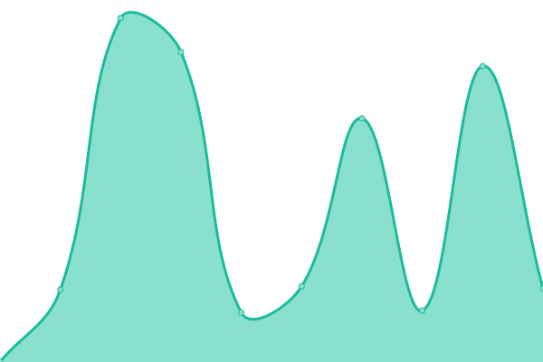
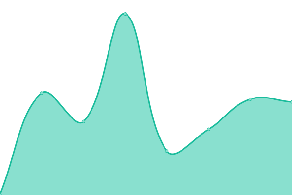
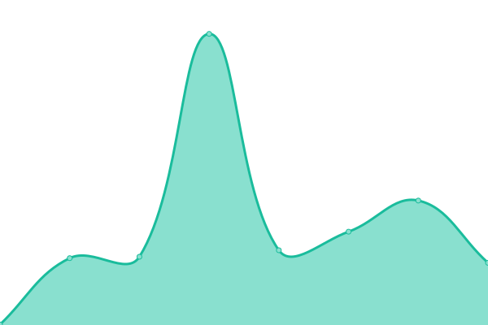
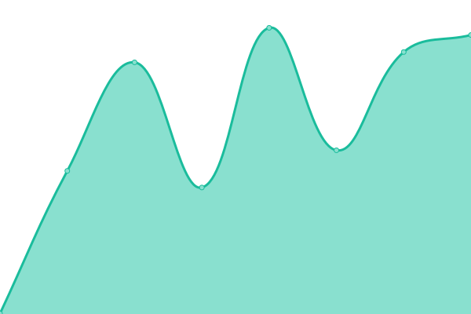
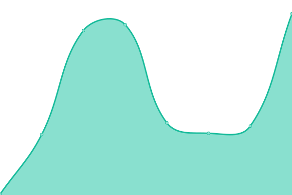
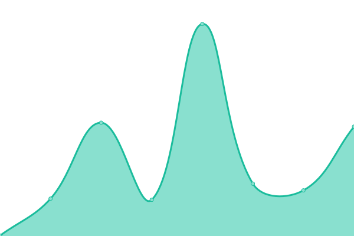
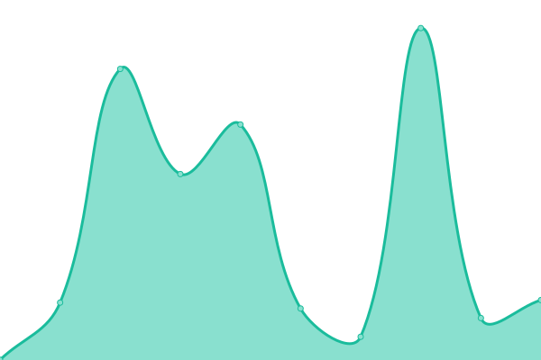

# [📈 Live Status](https://websimww.github.io/status): <!--live status--> **🟩 All systems operational**

This repository contains the open-source uptime monitor and status page for [Websim Wonder World](https://wwebsim.ai/@wwworld), powered by [Upptime](https://github.com/upptime/upptime).

With [Upptime](https://upptime.js.org), you can get your own unlimited and free uptime monitor and status page, powered entirely by a GitHub repository. We use [Issues](https://github.com/websimww/status/issues) as incident reports, [Actions](https://github.com/websimww/status/actions) as uptime monitors, and [Pages](https://websimww.github.io/status) for the status page.

<!--start: status pages-->
<!-- This summary is generated by Upptime (https://github.com/upptime/upptime) -->
<!-- Do not edit this manually, your changes will be overwritten -->
<!-- prettier-ignore -->
| URL | Status | History | Response Time | Uptime |
| --- | ------ | ------- | ------------- | ------ |
|  [Main Site](https://websim.ai/) | 🟩 Up | [main-site.yml](https://github.com/websimww/status/commits/HEAD/history/main-site.yml) | 

 293ms
     
 | 

<a href="https://websimww.github.io/status/history/main-site">100.00%</a>
    

|  [Avatars](https://avatars.websim.ai/13ac4d9a-fce5-4eef-a688-221884ad4235/CQOqjQvxkM47r4gME.webp) | 🟩 Up | [avatars.yml](https://github.com/websimww/status/commits/HEAD/history/avatars.yml) | 

 298ms
     
 | 

<a href="https://websimww.github.io/status/history/avatars">100.00%</a>
    

|  [Images](https://images.websim.ai/v1/site/Admdc3N7DvV192eus/600) | 🟩 Up | [images.yml](https://github.com/websimww/status/commits/HEAD/history/images.yml) | 

 258ms
     
 | 

<a href="https://websimww.github.io/status/history/images">100.00%</a>
    

|  [Project Screenshots](https://project-screenshots.websim.ai/0193a922-882e-7cfc-8b0d-960323df1155) | 🟩 Up | [project-screenshots.yml](https://github.com/websimww/status/commits/HEAD/history/project-screenshots.yml) | 

 310ms
     
 | 

<a href="https://websimww.github.io/status/history/project-screenshots">100.00%</a>
    

|  [Internal](https://internal.websim.ai/) | 🟩 Up | [internal.yml](https://github.com/websimww/status/commits/HEAD/history/internal.yml) | 

 491ms
     
 | 

<a href="https://websimww.github.io/status/history/internal">100.00%</a>
    

|  [OG](https://og.websim.ai/) | 🟩 Up | [og.yml](https://github.com/websimww/status/commits/HEAD/history/og.yml) | 

 172ms
     
 | 

<a href="https://websimww.github.io/status/history/og">100.00%</a>
    

|  [Omegabus](https://omegabus.websim.ai/) | 🟩 Up | [omegabus.yml](https://github.com/websimww/status/commits/HEAD/history/omegabus.yml) | 

 188ms
     
 | 

<a href="https://websimww.github.io/status/history/omegabus">100.00%</a>
    

|  [Page Images](https://page-images.websim.ai/) | 🟩 Up | [page-images.yml](https://github.com/websimww/status/commits/HEAD/history/page-images.yml) | 

 234ms
     
 | 

<a href="https://websimww.github.io/status/history/page-images">100.00%</a>
    

|  [API](https://api.websim.ai/api/v1/sites/LOGGED_IN/html) | 🟩 Up | [api.yml](https://github.com/websimww/status/commits/HEAD/history/api.yml) | 

 590ms
     
 | 

<a href="https://websimww.github.io/status/history/api">100.00%</a>
    

<!--end: status pages-->

[**Visit our status website →**](https://websimww.github.io/status)

## 📄 License

- Powered by: [Upptime](https://github.com/upptime/upptime)
- Code: [MIT](./LICENSE) © [Anand Chowdhary](https://anandchowdhary.com), supported by [Pabio](https://pabio.com)
- Data in the `./history` directory: [Open Database License](https://opendatacommons.org/licenses/odbl/1-0/)
